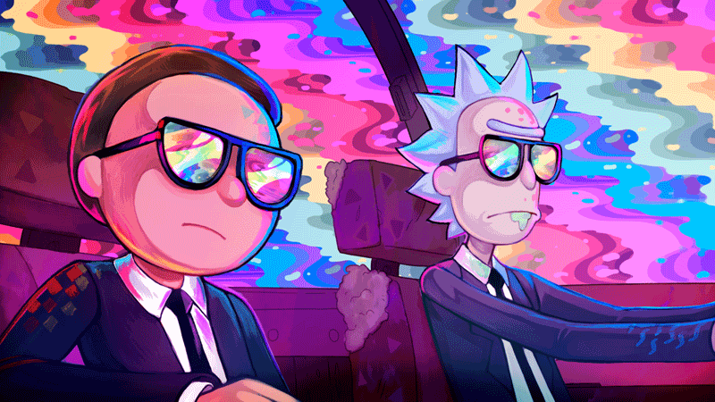

  

 
 
# Hi there   I'm Kushagra

- 🔭 I’m currently working     -  Back-end Development
- 🌱 I’m currently learning    -  Java
- 🤔 I’m looking for mentors   
- 💬 Ask me about any previous projects here and how I can go in depth.
- 📫 How to reach me: I do have some presence online such as twitter linked below my profile picture
- 😄 Pronouns:  Deus ex Machina 
-----

  

  
 

 

https://github.com/kastrahl/kastrahl/assets/56175823/b679fb76-86a7-4e62-a546-f1d9c7656dcd

figuring out how to autoplay unmute this video for a cooler github profile. 
just like tron  
But github hates those HTML tags...... 

<!---

 
 
-->

